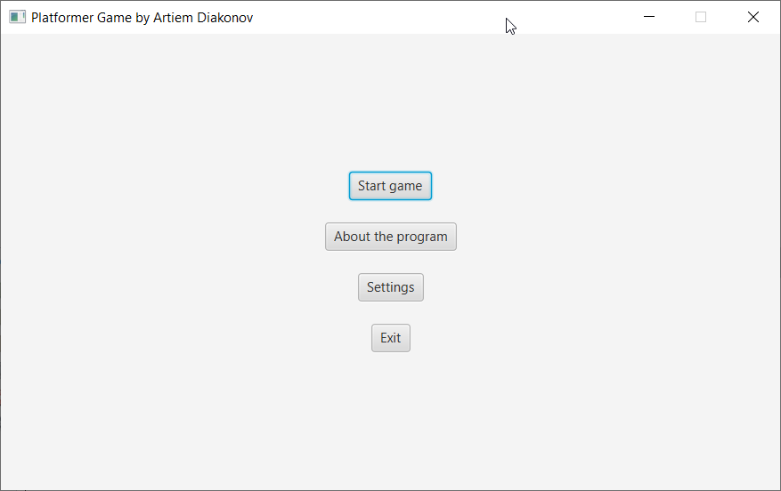
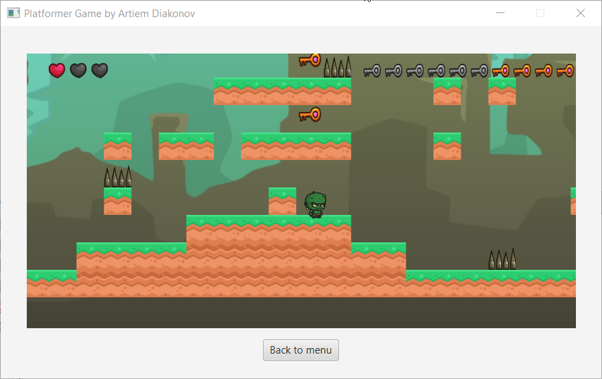
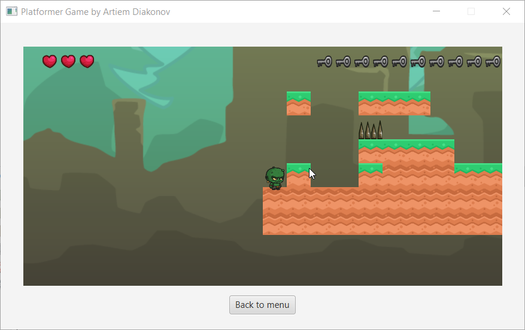

# JavaGame
First my project on Java + JavasFX

# 🕹️ Platformer Game – ProjektGrundlagen


> 📚 A student project: 2D platformer in Java + JavaFX with level generation and basic gameplay logic.

---

## 📽️ Preview





---

## 🔧 Features

- ✅ Main menu with submenus: New Game, Settings, About
- ✅ Procedural level generation (100x10 tiles) with platforms, spikes, keys, doors
- ✅ Level passability check
- ✅ Basic player character with keyboard control
- ✅ Camera movement and tile-based rendering
- 🧪 Rendering on JavaFX Canvas

---

## 🧱 Project Architecture

```
projektGrundlagen/
├── menu/           # Menu and screen handling
├── game/           # Game loop and rendering
├── level/          # Level generation, layers, loading
├── entities/       # Player and game objects (keys, spikes, doors, platforms)
├── collision/      # Collision checking
├── util/           # Utility classes
├── Constant.java   # Game settings (tile size, screen width, etc.)
└── Main.java       # Entry point
```

---

## ▶️ How to Run

### 📦 Using NetBeans

1. Open `pom.xml` as a Maven project.
2. Make sure JavaFX SDK is installed.
3. Add to VM Options:
   ```
   --module-path "/path/to/javafx-sdk/lib" --add-modules javafx.controls,javafx.fxml
   ```
4. Run `Main.java`.

### 💻 Using Terminal

```bash
# Build
mvn clean package

# Run
java --module-path /path/to/javafx-sdk/lib --add-modules javafx.controls,javafx.fxml  -jar target/projektGrundlagen-1.0.jar
```

> ⚠️ Replace `/path/to/javafx-sdk/lib` with the actual path to your JavaFX SDK.

---

## 🗺️ Dependencies

- Java 17+
- JavaFX (OpenJFX or Oracle)
- Maven
- OpenSimplex2F (built-in)
- NetBeans (recommended, optional)

---

## 🔮 Future Plans

- [ ] Player animations
- [ ] Enemies and NPCs
- [ ] Sound effects and music
- [ ] HUD and inventory
- [ ] Save/load levels

---

## 📄 License

This project is licensed under the [MIT License](LICENSE).

---

## 👤 Author

**Artiem Diakov**  
🎓 Educational project from Java programming fundamentals course  
📍 Germany


